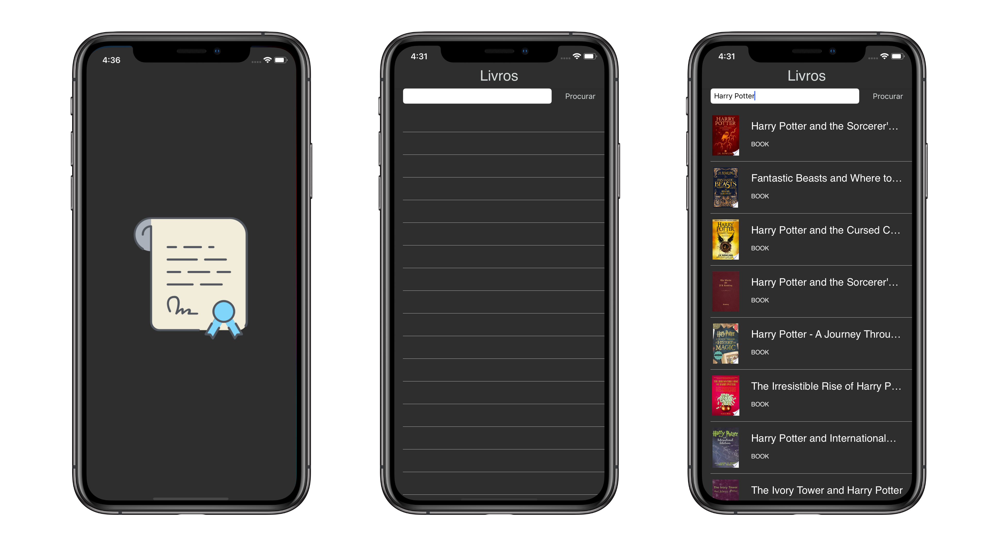

# Google-Books


**Google-Books** is a simple server and app for learn how to use search in Google Books.


### Dependencies 
    "express": "~4.16.1",
    "google-books-search": "^0.3.1",
    "cookie-parser": "~1.4.4",
    "debug": "~2.6.9",
    "hbs": "~4.0.4",
    "http-errors": "~1.6.3",
    "morgan": "~1.9.1"

### Installing

To run the server, we need to insert the folder that contains the `package.json` file.
1. Installing NodeJS dependencies:

```shell
$ npm install
```

2. Running the server:

```shell
$ npm start
```


## API - Application Programming Interface

#### Search Books by Name

Method: `GET`

Url: `url.com/books/search/{name-of-the-book}`

**Returns an array of JSON objects. For example:**

```
[
    {
        "id": "9KJJYFIss_wC",
        "title": "Professional Javascript For Web Developers 2Nd Ed",
        "subtitle": "...",
        "authors":[
            "Nicholas C. Zakas"
        ],
        "publisher": "John Wiley & Sons",
        "publishedDate": "2009-02-09",
        "description": "...",
        "industryIdentifiers": [
            {
                "type": "ISSN",
                "identifier": "..."
            }
        ],
        "pageCount": 840,
        "printType": "BOOK",
        "averageRating": "4",
        "thumbnail": "http://bks5.books.google.com.au/books?id=...",
        "images": {
            "small": "http://...",
            "medium": "http://...",
            "large": "http://...",
            "extraLarge": "http://...",
        },
        "language": "en",
        "link": "http://books.google.com.au/books?id=..."
    },

    ...

]
```
## Preview



# Thanks for Watch 
